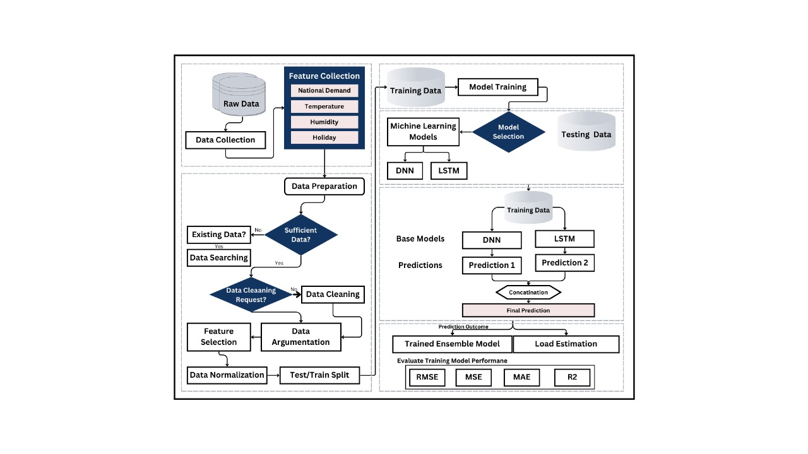
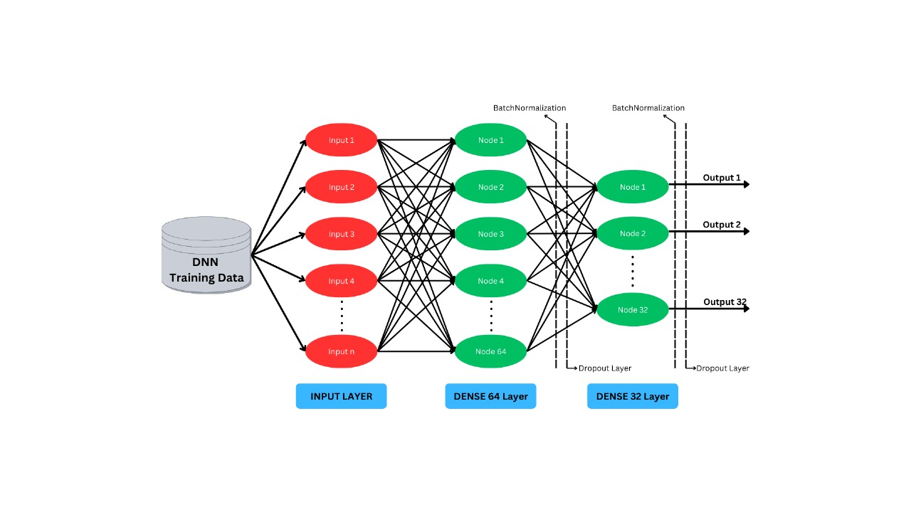
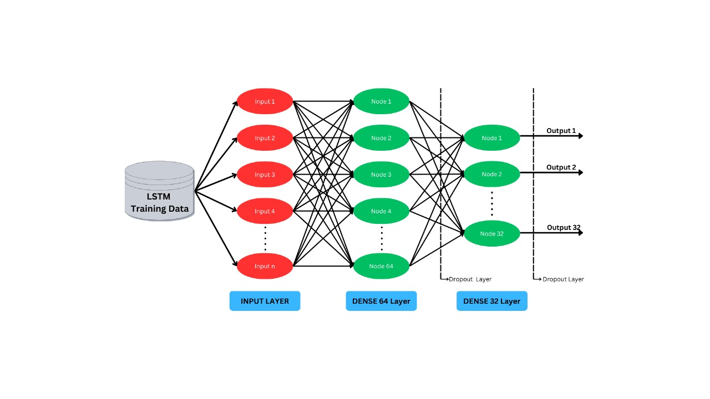

# Short-term Load Forecasting in Smart Grid using DNN and LSTM

## 📌 Overview
This project implements a **hybrid machine learning model** combining **Deep Neural Networks (DNN)** and **Long Short-Term Memory (LSTM)** networks to predict short-term electricity demand in smart grids.  
The **DNN** extracts complex, non-linear patterns from static data, while the **LSTM** handles sequential dependencies in time-series data. The system features a **Streamlit-based GUI** for easy interaction, visualization, and real-time forecasting.

---

## ✨ Features
- **Hybrid Model**: DNN for feature extraction + LSTM for temporal pattern modeling.
- **Streamlit GUI**: User-friendly interface for uploading data, running forecasts, and viewing results.
- **Real-Time Forecasting**: Generates short-term load predictions.
- **Customizable Parameters**: Adjust forecasting settings (time intervals, sensitivity, etc.).
- **Scalable & Flexible**: Adaptable to different grid sizes and datasets.
- **Visualization Dashboard**: Graphs, trend lines, and performance metrics (RMSE, MSE, MAE, R²).
- **Anomaly Detection**: Identifies unusual load patterns for proactive action.

---

## 🖼️ System Architecture


---

## 🖼️ DNN Model


---

## 🖼️ LSTM Model


---

## 🛠️ Tech Stack
- **Programming Language**: Python 3.7+
- **Frameworks/Libraries**:
  - TensorFlow / Keras
  - Pandas, NumPy, SciPy
  - Matplotlib, Seaborn
  - Streamlit (for GUI)
- **Data Sources**:
  - Smart meters & IoT sensors
  - Historical load datasets
- **Environment**:
  - Jupyter Notebook / PyCharm / VS Code
  - OS: Windows 10/11 or Ubuntu 20.04+
- **Hardware**:
  - CPU: Intel i5/i7 or AMD Ryzen 5/7
  - RAM: 16 GB (32 GB recommended)
  - GPU: NVIDIA GTX 1080 or higher (for faster training)

---

## 🚀 How It Works
1. **Data Collection & Preprocessing**
   - Load historical demand and weather data.
   - Clean, normalize, and engineer features (time, temperature, humidity).
   
2. **Model Training**
   - Train DNN for static feature extraction.
   - Train LSTM for sequential time-series dependencies.
   - Combine predictions for final forecasts.

3. **Deployment with Streamlit**
   - Real-time forecasting pipeline.
   - Interactive visualization and parameter adjustment.

---

## 📂 Project Structure

```
Mini-Project/
├── data/ # Historical datasets
├── models/ # Saved DNN and LSTM models
├── src/ # Jupyter notebooks and scripts
├── images/ # Diagrams and result images
├── main.py # Streamlit app
├── requirements.txt # Python dependencies
└── README.md # Project documentation
```
---

## ▶️ How to Run

### 1️⃣ Clone the Repository
```bash
git clone https://github.com/JithendraKavala/Mini-Project.git
cd Mini-Project
````

### 2️⃣ Install Dependencies

```bash
pip install -r requirements.txt
```

### 3️⃣ Run the Streamlit App

```bash
streamlit run app.py
```

### 4️⃣ Open in Browser

Streamlit will provide a local URL (e.g., `http://localhost:8501`). Open it in your browser to interact with the GUI.

---

## 📊 Results

The hybrid **DNN-LSTM** model:

* Outperforms traditional forecasting methods (ARIMA, ANN, SVR).
* Provides robust, accurate predictions in real-time.
* Adapts to different demand patterns and weather conditions.

---

## 🔮 Future Enhancements

* Integrate **Transformers** for improved time-series forecasting.
* Expand to mid- and long-term forecasts.
* Add **automatic model retraining** based on incoming data.
* Deploy to **cloud platforms** for multi-user access.

---

## 👤 Author

**Jithendra K.**
Bachelor of Technology in Artificial Intelligence and Machine Learning
Sri Vasavi Engineering College

